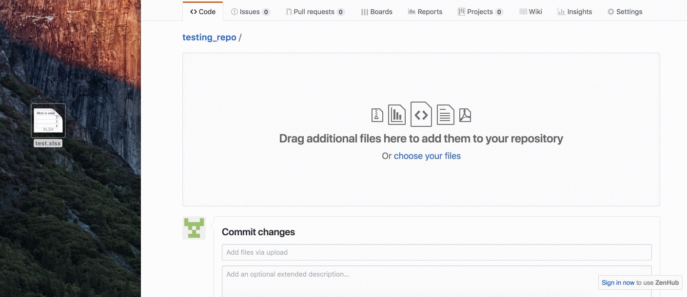

### Instructor Do: Adding files to Github

* Close out class by going over how to submit a homework assignment in Github. Explain to students that "GitHub offers a centralized location where all developers can push and pull (upload and download) their code. This means that GitHub always holds the most up-to-date code and files, handling everyone's updates appropriately. For now, students will only need to know how to use the GUI for GitHub in order to submit homework. However, In a couple of weeks, students will learn to work with GitHub through the terminal using git.

* Have the students follow along with the following steps:

  * Visit <https://github.com> and ask students to login to their personal accounts. From the main page, create a new repository with an initialized `readme.md` file. Explain that a readme is the landing page for each repository that will explain the codebase.

    

  * Switch back to the Desktop and create a new empty excel file and save it. This will be used to demonstrate how to upload new files.

  * Navigate back to the repo and click **Upload files**.

    

  * Drag the new excel file from the desktop into the repo. Add a commit message and commit the changes.

  * Finally, show that the new file is now safely saved to the repository.

    

* Make sure that all the students have been able to follow along so far. Let students know that this is will be how they will be submitting their homework for the first two weeks. Students will add all of the necessary files to their Github Repo then submit the repository link to BCS.

* Along with the TAs be prepared to walk around and help students with the next exercise.

### Students Do: Adding more file (0:10)

* **Instructions**

  * Create a new Repo in GitHub.

  * Create 2 to 3 files of any type locally on your computer.

  * Upload those files to your newly created repo.

  * Slack the link to the person next to you and make sure they can see your repo and that you can see their repo.

* **Bonus**

  * Modify one of you files and rep-upload them to your repo.
