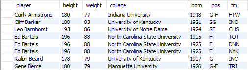
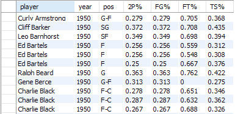

## Unit 10.2 - MySQL Queries and Joins

### Overview

In today's class students will be diving more deeply into MySQL and will learn how to perform complex queries and joins on databases.

### Class Objectives

* Students will be able to import large CSV datasets into MySQL Workbench using the import wizard

* Students will be able to use MySQL to select specific rows/columns of data out from a table

* Students will understand the different kinds of joins and how to use them to create new tables in MySQL

- - -

### Activities Preview

* **MySQL Warmup**

* Instructions

  * Create a new database called `Second_International_Bank` using MySQL Workbench

    * Within this new database, create a table called `Customers` with six columns that are capable of holding the following values...

      * `ID`: An integer that will be used as the primary key for the table and automatically increments

      * `FirstName`: A string which will hold a customer's first name

      * `LastName`: A string which will hold a customer's last name

      * `Loan`: A boolean which will let users know if the customer has any unpaid loans

      * `Checking`: A decimal value which will let users know how much money a customer has in their checking account

      * `Savings`: A decimal values which will let users know how much money a customer has in their savings account

    * Create five new rows of data to fill up the `Customers` table with some data

* **Hide and Go Seek**

* Instructions

  * Start by using the Table Import Wizard to create a new table called `wordassociation` with the data stored within `WordAssociation-AC.csv`.

  * Come up with a means to add a new column to this table that will act as an "ID" column. This column should act as the primary key and auto-increment. By doing this, each row will now have a unique ID.

  * Import the values stored within `WordAssociation-BC.csv` and `WordAssociation-CC.csv` into the table created. This can take some time, so look through the CSV files or read through some [MySQL tutorials](https://www.w3schools.com/sql/) whilst waiting.

  * Create a query that collects all of the rows whose "source" is "AC"

  * Create a query that collects all of the rows whose "source" is "BC"

  * Create a query that collects all of the rows whose "source" is "CC"

  * Create a query that collects all of the rows whose author is within the range of 0-20

  * Create a query that searches for any rows that have "pie" in their "word1" or "word2" columns

* **Seek, Create, Update, and Destroy**

* Instructions

  * Import the `GlobalFirePower.csv` into a new table within a localhost database.

    * Add a primary key to the table.

    * Find all of those rows that have a "ReservePersonnel" of 0 and then remove these rows from the dataset. **Note** MySQL often adds a safety measure to avoid deleting data check [Stack Overflow](https://stackoverflow.com/questions/11448068/mysql-error-code-1175-during-update-in-mysql-workbench) for help.

    * Every country in the world at least deserves one "FighterAircraft". Only seems fair. Lets add one to each nation that has none.

    * Oh no! By updating this column, the values within "TotalAircraftStrength" column are now off for those nations! We've got to [add one](https://stackoverflow.com/a/2680352) to the original number.

    * Find the [Averages](https://www.w3schools.com/sql/sql_count_avg_sum.asp) for `TotalMilitaryPersonnel`, `TotalAircraftStrength`, `TotalHelicopterStrength` and `TotalPopulation`. Record these averages.

    * A new nation has been founded and you are declared its leader! Congratulations! Unfortunately for you, every other nation is now looking to take over your land. Insert a new country with the averages values you have just calculated.

* **Joining the NBA**

* Instructions

  * Using tables made from `Players.csv` and `Seasons_Stats.csv`, perform joins that will create the following tables...

  * Basic Information Table:

    

  * Percent Stats:

     

* **SQL is Witchcraft!**

* Instructions

  * Open up the zipped folder provided and look through the CSV files contained within. As you are examining these files, take note of how they reference each other using different ID columns.

  * While you are performing your investigation on one computers, start importing these CSV files into a MySQL database using another.

  * Once all of the files have been imported, begin to create joins between the tables that would allow users to view more detailed information per witchcraft trial.

  * As you are creating joins, attempt to create new permanent tables that contains the data collected by your joins. You can use this [Stack Overflow response](https://stackoverflow.com/a/6595301) as a good starting point to how this can be accomplished.

  * Attempt to create as comprehensive a table as possible. At the end of this activity, partners will share what their final tables look like and explain why they chose to make them this way.

- - -

### Copyright

Trilogy Education Services © 2018. All Rights Reserved.
