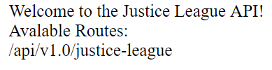
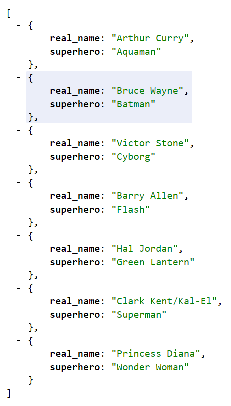

## Unit 11.3 - Introduction to Flask & Serving Data with APIs

### Overview

Today's lesson introduces students to the fundamentals of the web and client-server architecture;  how to use Flask to create a database-backed server; and how to use the same to design and implement API endpoints.

### Class Objectives

* Students will be able to use Flask to create and run a server
* Students will define endpoints using Flask's @app.route decorator
* Students will learn to extract query variable path values from GET requests
* Students will use variable paths to execute database queries on behalf of the client
* Student will learn to return JSONified query results from API endpoints

- - -

### Activities Preview

* **Dates**

* In this activity, students will practice working with dates, both in SQLAlchemy and with the `datetime` library. The instructions are included in the notebook file as comments.

* **Hello, Web**

* Instructions

* Take a moment to run [Activities/05-Stu_Hello_Web/Solved/app.py](Activities/05-Stu_Hello_Web/Solved/app.py), and open it in the browser at [localhost:5000](http:127.0.0.1:5000). Demonstrate each of the below endpoints:

  * `/`

  * `/about`

  * `/contact`

* Point out that each of these endpoints simply returns a string.

* Take a moment to address any questions before allowing students to work.

* **Justice League**

* Instructions

* Explain that students' task for this activity is to create a server configured to send welcome text at its index endpoint, and JSON data at its `api/v1.0/justice-league` endpoint.

* Run [Activities/07-Stu_Justice_League/Solved/app.py](Activities/07-Stu_Justice_League/Solved/app.py), and navigate to `localhost:5000/` in your browser to demonstrate the index route.

  

* Navigate to `localhost:5000/api/v1.0/justice-league` in your browser to demonstrate the API route.

  

* Answer any questions, and then give them time to work on it.

* **Routes with Variable Rules**

* Instructions

* Run [Activities/09-Stu_Variable_Rule/Solved/app.py](Activities/09-Stu_Variable_Rule/Solved/app.py), and demonstrate its `/api/v1.0/justice-league/superhero/<superhero>` endpoint by visiting [localhost:5000/api/v1.0/justice-league/superhero/superman](http://127.0.0.1:5000/api/v1.0/justice-league/superman) (**but try to keep the URL hidden**).

* Point out that this route is functionally identical to the `<real_name>` route from before, but allows users to specify the desired value of the character's `superhero` key instead.

* Take a moment to answer any questions before moving on.

* **Chinook Database Analysis**

* Instructions

* This is the final activity for the Advanced Data Storage and Retrieval Unit. The goal of this activity is to give students additional practice in analysis of databases using the SQLAlchemy ORM. Encourage the students to take their time and ask plenty of questions as they go through this.

* Explain that the students will be analyzing invoice data from the [Chinook database](https://chinookdatabase.codeplex.com/wikipage?title=Chinook_Schema&referringTitle=Home).

* Explain to the students that they will design SQLAlchemy ORM queries to answer specific questions about the invoice data.

- - -

### Copyright

Trilogy Education Services © 2018. All Rights Reserved.
