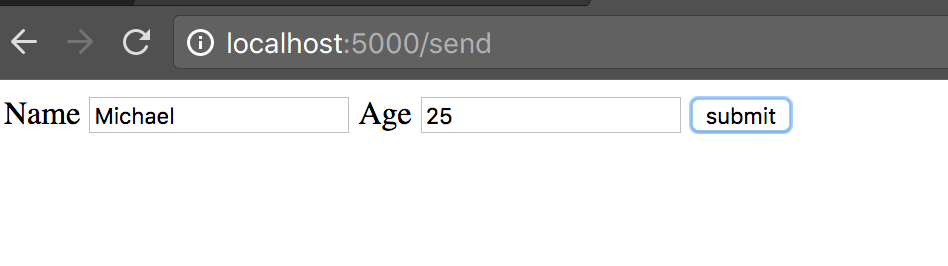
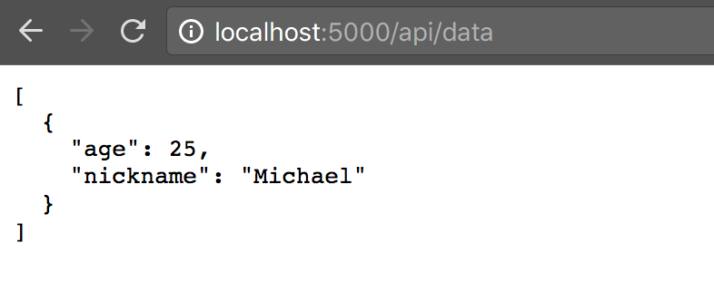
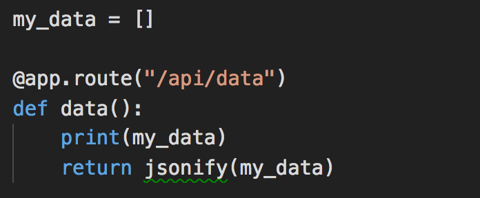
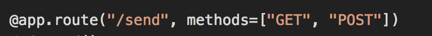
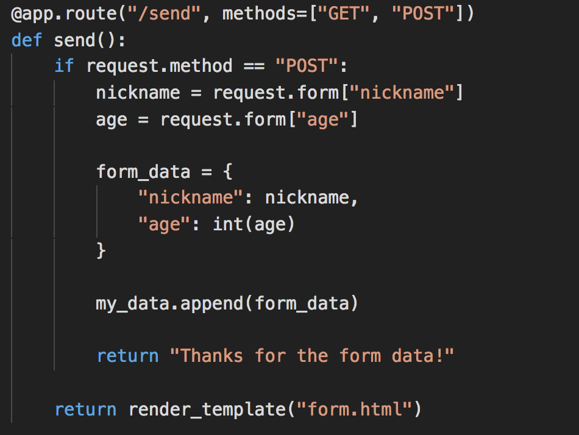
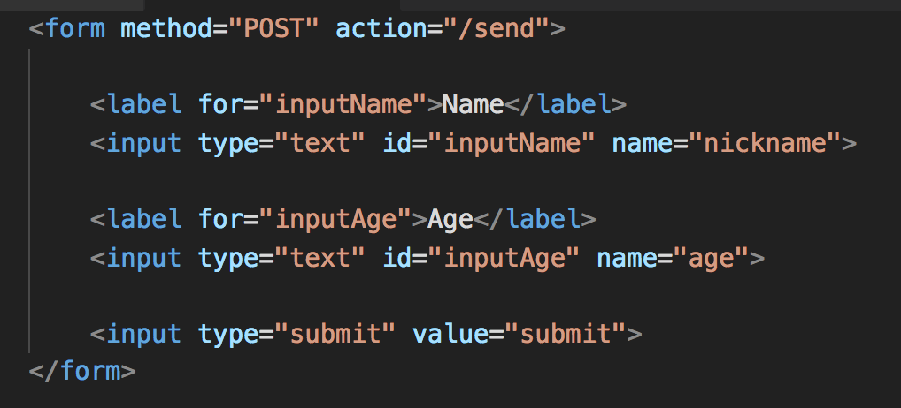

## Unit 15.3 - Thanks a Plot!

### Overview

Today's lesson will show students how to create full-stack visualizations using Flask, Plotly, and SQLAlchemy. Finally, students will deploy an app to Heroku.

### Class Objectives

* Students will be able to use Flask to render a Plotly visualization to the browser.

* Students will use Flask to serve data to a Plotly frontend.

- - -

### Activities Preview

* **Never Gonna Give You Up**

* Instructions

  * In this activity, students will create an app displaying a pie chart of Rick Astley's _Never Gonna Give You Up_ lyrics.

* **Bigfoot Afoot**

* Instructions

  * In this activity, students will create a full-stack application comprising a database, server, and front end.

* **Flask Requests**

* Instructions

  * This is an important activity, in which we will cover GET and POST routes. Feel free to demonstrate the code, or have the class code along with you, whichever you deem more appropriate for your class.

  * Start `app.py` and open the browser to the `/send` endpoint:

    

    * It displays a very simple form.
    * Enter the information of yourself, or one of your students, and click `submit`.

  * Now navigate to `/api/data`:

    

    * It now displays, in JSON, the data submitted from the form.

    * Up to this point, we have created Flask routes to **serve** information.

    * We can also create routes to **receive** information.

  * We begin with an empty list called `my_data`, and return the information in the list when the `/api/data` route is called:

    

  * We **receive** information from the HTML form:

    

  * In the `/send` route, two methods are possible: `GET` and `POST`.

  * Research `GET` and `POST` methods, the so-called HTML verbs.
  <https://www.w3schools.com/tags/ref_httpmethods.asp>.

    * In brief, the GET method is used by the client to retrieve data with the browser, and the POST method is used to submit data.

  * In light of this information, take a look at the `/send` route, and figure out what is going on:

    

    * If the method is POST, the `nickname` and `age` from the form are saved to the `my_data` list.
    * After submitting, the web page says, "Thanks for the form data!"
    * If the method is GET (i.e. not POST), `form.html` is rendered.

  * The `/send` route has two possibilities: one to display the form, and another to submit and save the data from the form.

  * Turn now to the code in `form.html`:

    

    * The `POST` method is specified in the `<form>` tag.
    * The route name, `/send`, is specified as `action`.
    * Two pieces of data here that are submitted to the POST route are `nickname` and `age`.
    * Upon clicking the `submit` button, the data is submitted to the server.

* **Pet Pals**

* Instructions

  * In this activity, students will build a full stack app with a SQL database, and use the database information to dynamically build a chart in Plotly.

* **Heroku Deployment**

* Instructions

  * In this activity, we will deploy the Pet Pals application to Heroku. This step consists of 3 main parts:

    1. Prepare the application with additional configuration files (`Procfile` and `requirements.txt`)
    2. Create the Heroku application
    3. Prepare the Heroku database

- - -

### Copyright

Coding Boot Camp © 2017. All Rights Reserved.
