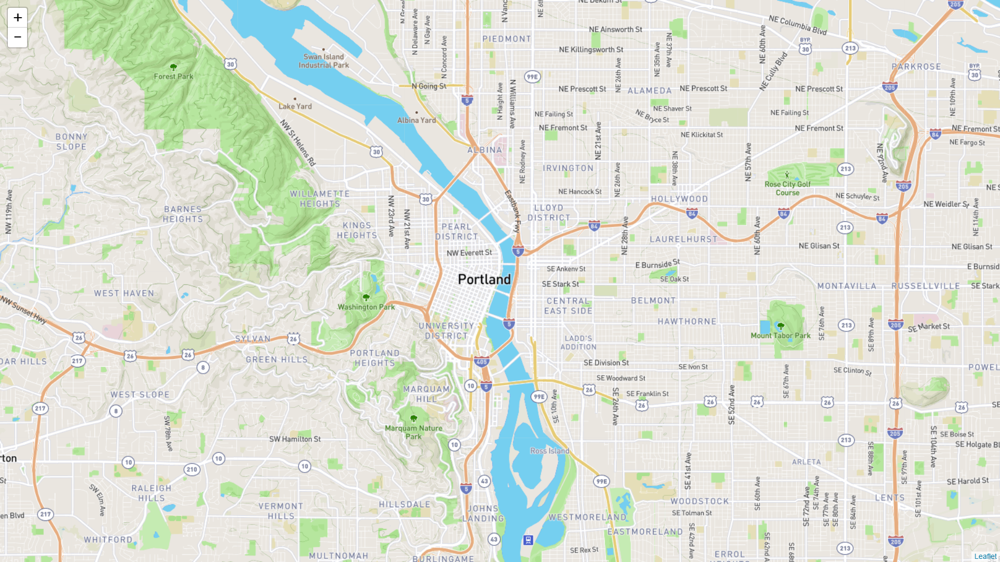
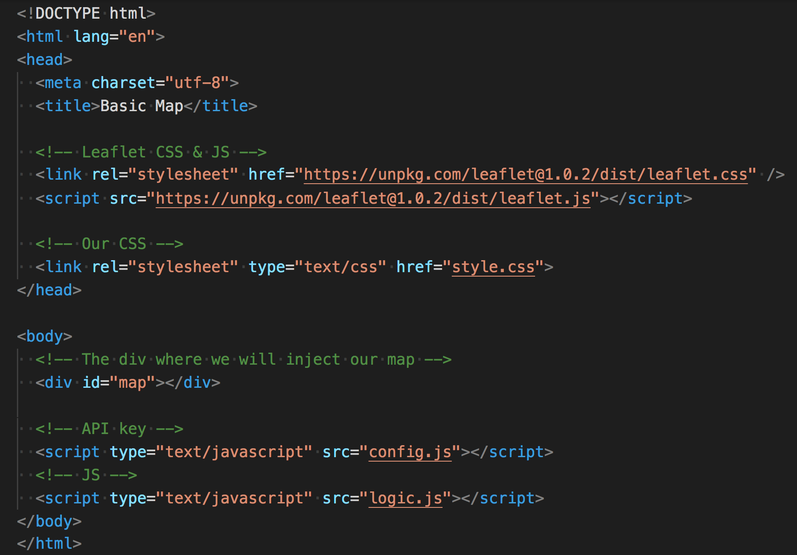
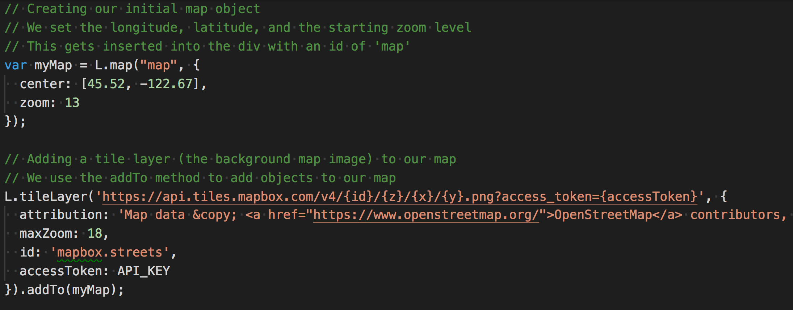
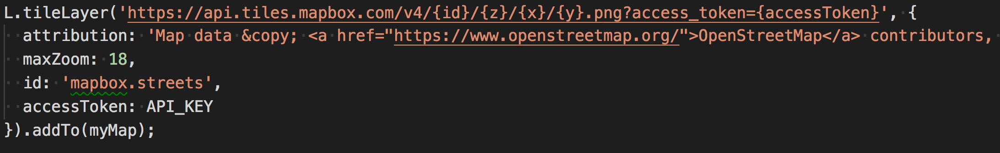
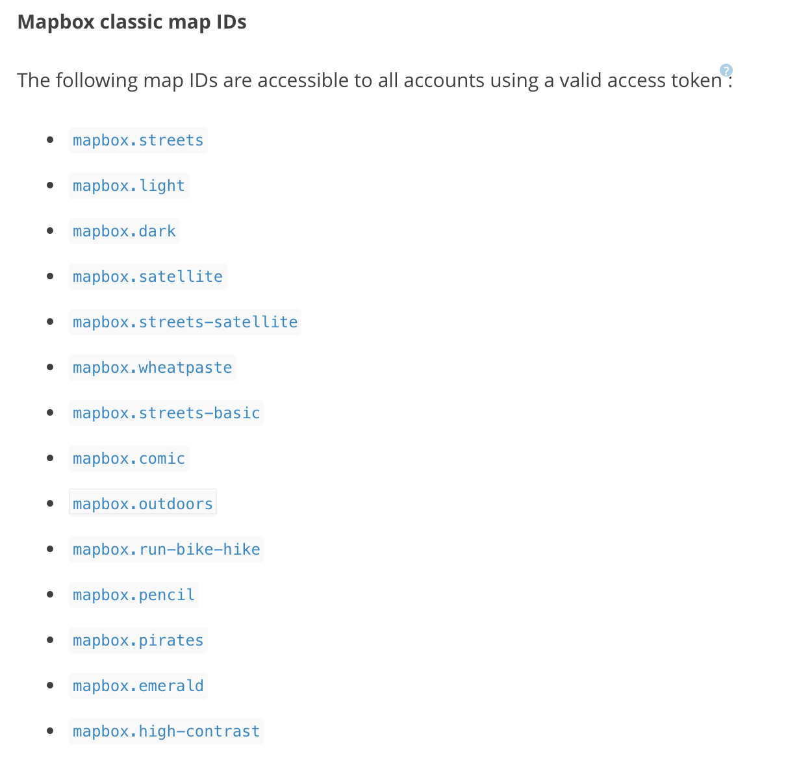

## Unit 17.1: Data Visualization with Leaflet

### Overview

Today's lesson will be spent introducing students to data visualization with maps. Students will gain a basic understanding of the Leaflet.js mapping library before diving headfirst into a number of increasingly involved examples.

### Class Objectives

* Students will understand the benefits that visualizing data with maps can provide.

* Students will learn the basics of creating maps and plotting data with the Leaflet.js library.

* Students will gain an understanding of the GeoJSON format.

* Students will understand the concept of layers and layer controls and how we can use them to add interactivity to our maps.

- - -

### Activities Preview

* **Leaflet & Our First Map**

* Visit [Leaflet.js web-page](http://leafletjs.com/) and look around, as this is the library we will be using for the majority of the unit.

* Follow along the code used to build the Leaflet map found in [Ins_Basic_Map](Activities/01-Ins_Basic_Map).
* This is the most basic map you can make with Leaflet and it will be our starting point in the wonderful world of geospatial data visualization!

  

* Open the `logic.js` file in your editor and walk through the key aspects of the code:

  * Map Object
  * Tile Layer

* The Leaflet quick start guide: [https://leafletjs.com/examples/quick-start/](https://leafletjs.com/examples/quick-start/). 

* Setting up a basic map with Leaflet.

  1. Create a new HTML file.
  2. Add links to the Leaflet CSS and JavaScript libraries.
  3. Create a `
` with an `id` of `map`. This is where our map will be inserted.

   

  4. Next, create a `logic.js` file and link it to the HTML.
  5. Write or copy and paste the following code into your `logic.js` file.

   

  6. Add a tile layer to the map.

   

  7. For this step, create a free account with [Mapbox](https://mapbox.com) and [generate a token](https://www.mapbox.com/studio/account/tokens/) to get started.
  8. Navigate to [https://www.mapbox.com/api-documentation/#maps](https://www.mapbox.com/api-documentation/#maps) and explore some of the map stylings that are available:

   

  9. The API token is held in `config.js`.

   

  10. Finally, we need to give our map some CSS styling to make it visible on the page. The following CSS will allow our map to take up the entire page.

    

  11. Now open the HTML file in your browser. Yay, we have a map!

    

* **Quick Labeling Exercise**

* Instructions

  * [README](Activities/03-Stu_City_Markers/README.md)

* **Other Types Of Markers**

* Instructions

  * [README](Activities/05-Stu_Other_Markers/README.md)

* **World Cup Visualized**

* Instructions

  * [README](Activities/07-Stu_Country_World_Cup/README.md)

* **Layer Activity**

* Instructions

  * [README](Activities/09-Stu_City_Population_Layers/README.md)

* **GeoJSON activity**

* Instructions

  * [README](Activities/10-Stu_Geo-Json/README.md)

- - -

# Copyright

Data Boot Camp © 2018. All Rights Reserved.
