## Unit 21.3 - Neural Networks and Deep Learning!

### Overview

Today's lesson provides students with an introduction to neural nets and deep learning using Keras.

### Class Objectives

* Students will be able to articulate specific problems on which neural networks perform well.

* Students will be able to use Keras to build and train neural networks.

* Students will be able to use Keras to build and a train a deep neural network.

* Students will understand unsupervised learning and how to apply the Kmeans algorithm.

- - -

### Activities Preview

* **Building Neural Nets with Keras**

* Instructions

    * First, use sklearn to build a dataset with 100 samples and 3 features.  Then, create our training and testing data.

    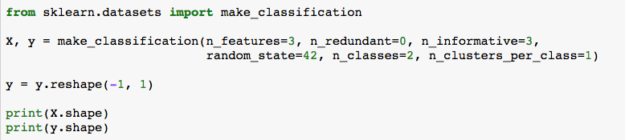

    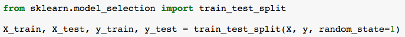

    * Scale the feature data using the StandardScaler.  Remember to scale both the testing and training data.

      * Scaling is extremely important with neural networks.  Without scaling, it is difficult for the training cycle to converge.

      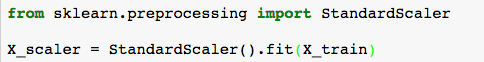

      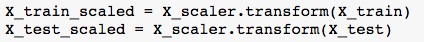

    * Note that for regressions the y-values will also be scaled, but in this case it is not necessary since one-hot-encoding is used for the outputs.

      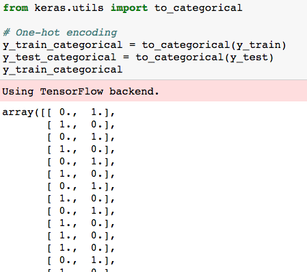

    * Create a sequential model.  This means that the data flows from layer to the next.

      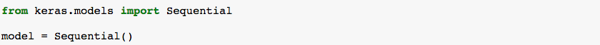

    * Next, add a layer to the function using `Dense` (for a densely connected layer).

      * Here, specify the number of of inputs as the `input_dim` parameter which should be equal to the input dimensions (number of features).

      * Additionally, `units` is the number of desired nodes in the layer.

      * Also, specify the type of activation function.  Here, ReLu is used.

      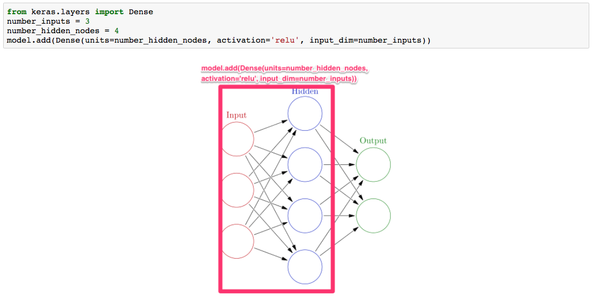

    * Add an output layer.

      * Since this is a classification model, the number of nodes in this layer should equal the possible outcomes or classes.  For example, if three outcomes were available, then this layer would have 3 nodes.  This example has two outcomes, therefore two nodes are used.

      * The softmax activation function is used which is typically used in a neural network classifier.

      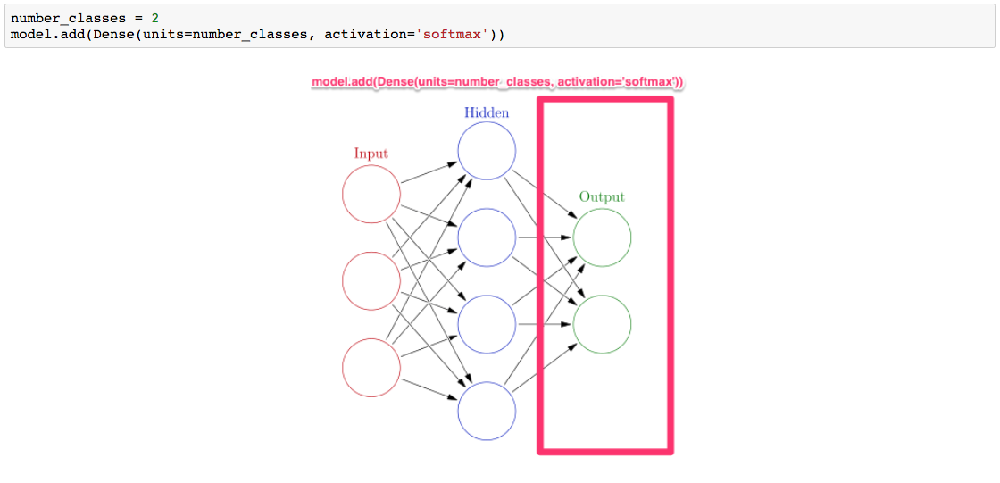

    * `model.summary()` gives us the output shape as expected; 4 nodes in the first layer and 2 in the final layer.

      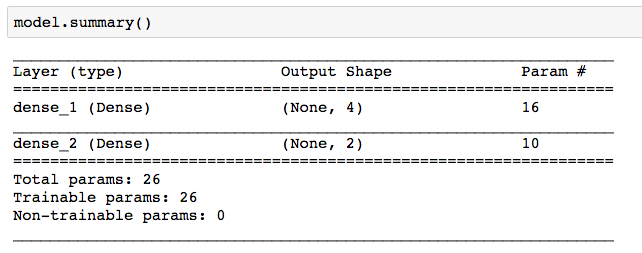

    * Now that the structure of the model has been defined, it is compiled using a loss function and optimizer.

      * Use Categorical Crossentropy for classification models and MSE (Mean Squared Error) for linear regression.

      * Here, an additional training metric, `accuracy`, is also specified.

      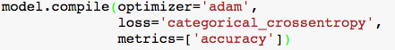

    * Finally, train (fit) the model!

      * Training consists of using the optimizer and loss function to update weights during each iteration of your training cycle.  This training using 1000 iterations or epochs.

      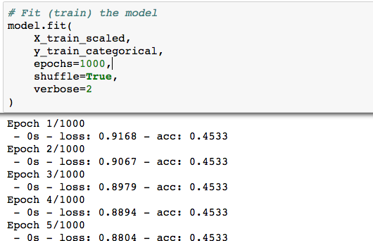

    * Evaluate the model using our testing data.

      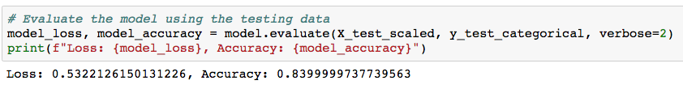

    * Make predictions with the model.

      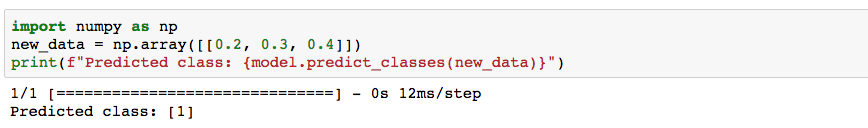

* **Moons**

* Instructions:

  * Create a Neural Network and Deep Neural Network Classifier that correctly classifies both moons from the dataset.

  * Train both models using 100 training epochs.

  * Compare the accuracy of both models.

* **Deep Voice**

* Instructions:

  * Create a deep learning model with 2 hidden layers.  Each layer should have 100 nodes.

  * Compile and fit the model.

  * Quantify (score) the model.

  * Use the first 5 testing data points to make predictions.  Then, compare the predictions to the actual labels.

* **Predicting Human Activity from Smartphone Accelerometer Data**

* Instructions:

  * Follow the comments in the provided starter file to:

    * Encode necessary labels.

    * Build and train a deep learning model.

    * Save the model.

    * Load to model.

    * Use the loaded model to predict the activity of a smartphone user based one data point from the test set.

* **KMeans**

* Instructions:

  * Use the starter code to fit a Kmeans model to a dataset.

  * Visualize the results by creating a plot that looks like the following.

    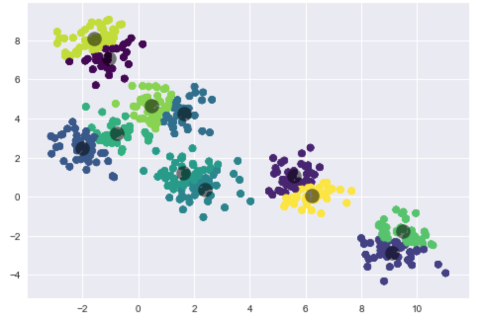

- - -

### Copyright

Trilogy Education Services © 2018. All Rights Reserved.
