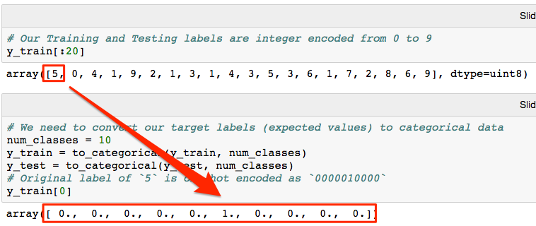
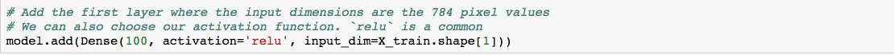
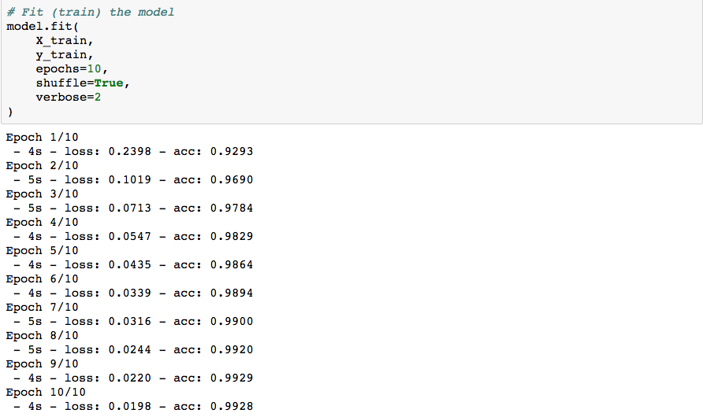
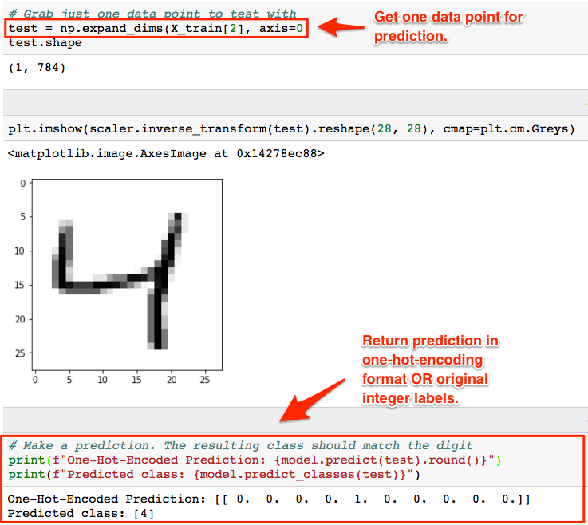
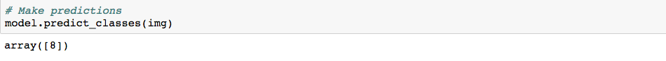

## Unit 21.4 - Convolutional Neural Networks

### Overview

In this class, students will use neural networks and pre-trained convolutional neural networks (CNN) for handwriting and image recognition.

### Class Objectives

* Students will be able to import a pre-trained CNN model.

* Students will be able to load an image from file into a data array.

* Students will be able to apply preprocessing to the input data.

* Students will be able to use the pre-trained model to make a prediction.

- - -

### Activities Preview

* **MNIST**

* Instructions:

  * Load the MNIST handwriting dataset from Keras.  The dataset includes 60,000 grayscale handwritten numbers.

  

  * Show the first digit from the dataset using matplotlib to plot the image.

  

  * Explain that these images consist of arrays of pixel values where a value of `0` represents all white while a value of `255` represents all black.

  

  * The images must be reshaped from 28x28 pixels to a 1 dimensional array of 784 pixels. Imagine taking the top left and bottom right corners of our image and stretching the image out into a single array of pixels.

  

  * After reshaping the pixel values, apply `MinMaxScaler`.  `MinMaxScaler` scales the data from 0 to 1.  In this example, 0 will represent all white and 1 all black.

  * Then, apply `one-hot-encoding` to the y labels. In this dataset, the labels are the digits `0-9`.  This converts the label to a binary representation of the digit (i.e. an array of `[0,0,0,0,1,0,0,0,0]` represents the digit `5`).

  

  * Finally, construct the deep learning model. For this example, use two hidden layers of 100 nodes each, and an output layer with 10 nodes (one for each digit).

  
  
  

  * Then, compile and fit the model to the data.

  
  

  * Save our trained model for later use in today's class.

  

  * Show that the accuracy of the model using the test data is extremely high.

  

  * Now, use the trained model to make predictions.

  * Choose a data point to predict.  `np.expand_dims` converts the input data from a shape of (,784) to (1, 784) as Keras expects.

  * Show that `model.predict()` can be used to obtain a prediction in the `one-hot-encoded` format, while `model.predict_classes()` will automatically convert from the `one-hot-encoding` to the original integer encoding.

  

  * Next, import a custom image using keras.  Setting the `target_size` parameter as the image size will resize the image to be consistent with the image sizes with which the model was trained. Import it as a grayscale image.

  * Resize the image to the size the model was trained on, 28x28 pixels, and then convert the image to an array.

  

  * Show that instead of `MinMaxScaler` the data is manually scaled using `image /= 255`.

  * The image data must be reshaped into a 1 dimensional array before using the model.

  

  * The original data is black digits on a white backgrounds, but the custom image is inverted. Simple subtraction, `img = 1 - img`, will invert the pixels.

  

  * Finally, a prediction can be made.

  

  * Take some extra time to answer any questions before moving on.

* **Flask Images**

* Instructions:

  * Take a minute to understand the provided start code.

  * Create code that will:

    * Read the file.
    * Save the filename to a variable.
    * Save the uploads folder path to a variable.
    * Save the file to the path.
    * Load the image using Keras and resize it to 28 by 28 pixels.
    * Preprocess the image with the given function, `prepare_image`.

* **Explore CNN**

* Instructions:

  * Work with a partner to answer the following questions:

    1. What is a Convolutional Neural Network (CNN)?

    2. What is a CNN typically used for?

    3. What is the difference between a CNN and Deep Neural Network?

* **Xception**

* Instructions:

  * Visit the [Xception](https://keras.io/applications/#xception) documentation to determine the image_size and other parameters needed to load and use the model.

  * Pre-process the test image using the model's `preprocess_input` function.

  * Use the trained model to predict the output label for the puppy image.

- - -

### Copyright

Trilogy Education Services © 2018. All Rights Reserved.
