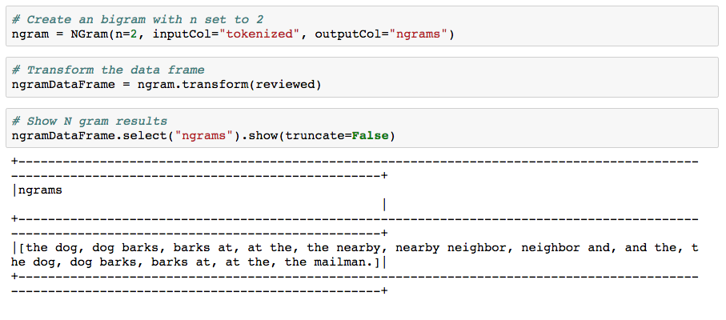
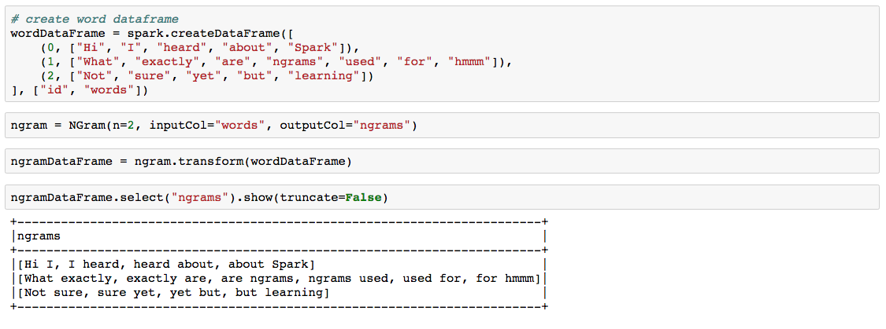
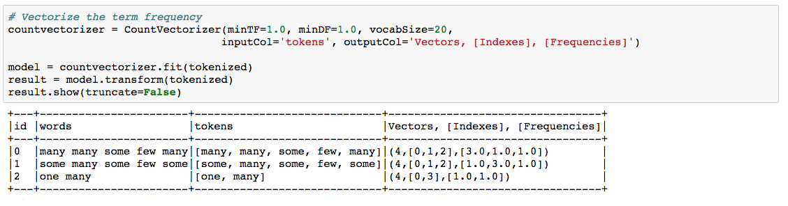
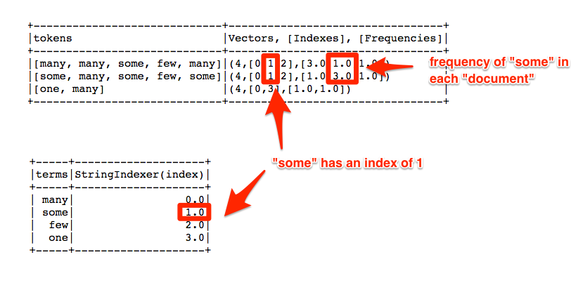
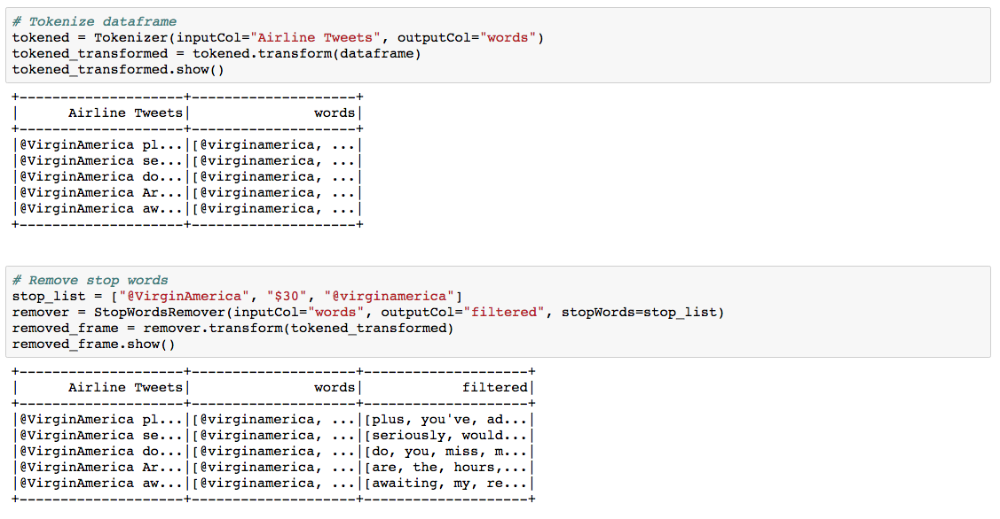
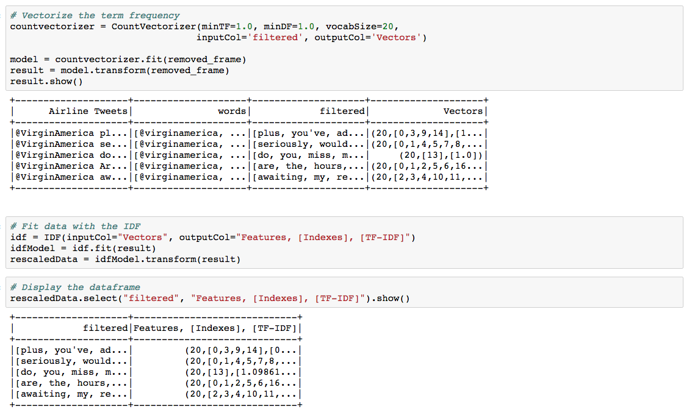
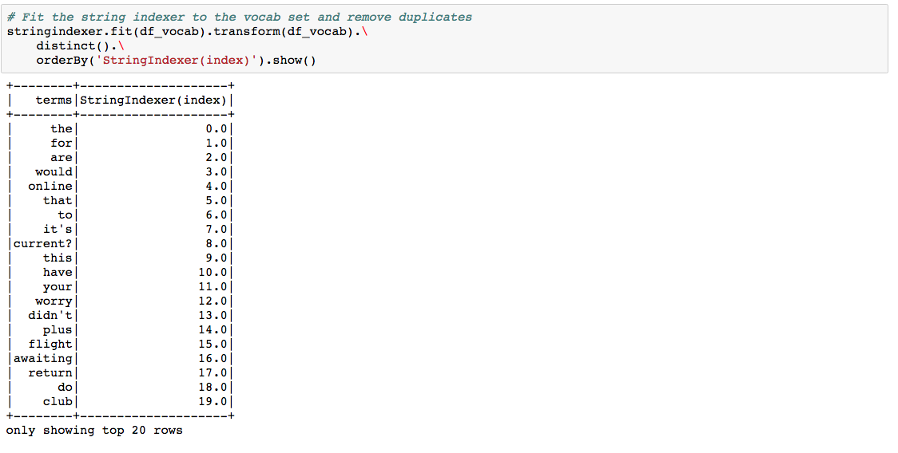

### . Instructor Do: PySpark NLP Ngrams (5 mins)

* **Note** if pressed for time feel free to skip this exercise for now. It is not needed for the final example showing how a spam filter works.

  * Go over the slide on Ngrams.  Be sure to point out the image explaining unigram, bigrams, and trigrams.

  * Give context to the usage of ngrams by giving examples of their use as outlined in the slideshow.

* Import [06-Ins_Pyspark_NLP_Ngrams/nlp_ngrams.ipynb](06-Ins_Pyspark_NLP_Ngrams/Solved/nlp_ngrams.ipynb) into ZEPL and run the code.

* The documentation says that N-grams are a sequence of **n** tokens (typically words) for some integer **n**. Take in a sequence of strings, like the output of a tokenizer and the parameter n is used to determine the number of terms in each n-gram. The output will consist of a sequence of n-grams where each n-gram is represented by a space-delimited string of n consecutive words. If the input sequence contains fewer than n strings, no output is produced.

* Walk students through the code and be sure to explain:

  * Just as `Tokenizer` and `StopWordsRemover` took in an input column and an output column so does `NGram`. This time a third argument is taken `n` for the number of tokens desired in each sequence.

  * The rest should look familiar with transforming the DataFrame and showing the results.

  

### 1. Student Do: PySpark NLP Ngrams (0:10)

* **File:**

  * [07-Stu_Pyspark_NLP_Ngrams/Unsolved/nlp_ngrams.ipynb](07-Stu_Pyspark_NLP_Ngrams/Unsolved/nlp_ngrams.ipynb)

* **Instructions:**

* [README.md](07-Stu_Pyspark_NLP_Ngrams/README.md)

### . Instructor Do: Review PySpark NLP Ngrams (5 mins)

* Take a few minutes to review the activity using [07-Stu_Pyspark_NLP_Ngrams/Solved/nlp_ngrams.ipynb](07-Stu_Pyspark_NLP_Ngrams/Solved/nlp_ngrams.ipynb) as a sample.

* The solution should be similar to the previous activity.

* Stress that here the text data that has already been tokenized as an input.  Normally, tokenization would be a step in the NLP pipeline.

### . Instructor Do: PySpark NLP Count Vectorizer (10 mins) ()

* Import [10-Ins_Pyspark_NLP_CountVectorizer/Solved/count_vector.ipynb](10-Ins_Pyspark_NLP_CountVectorizer/Solved/count_vector.ipynb) into ZEPL. Explain as you go:

  * As opposed to the `HashingTF` the `CountVectorizer` extracts and counts the vocabulary  when a `CountVectorizerModel` is fit to the documents.

  * The `CountVectorizer` function will convert tokenized text to a vector containing token counts (term frequency).

  * Reiterate that `CountVectorizer` has three parameters that it can additionally take.

    * `minTF` - the minimum number of times a word must occur in order to be included.  Using a value of one will ensure all words are included.
    * `minDF` - the minimum number of times a word must occur int he document in order to be included.  Using a value of one will ensure all words are included.
    * `vocabSize`- the amount of the top occurring words to be returned.  Use a number equal to or greater than the vocab size to include all words.

  * The results will be returned in descending order of values, based on the frequency of the term across the entire corpus, not just the current document.

  * The word `many` appears the most through the entire corpus so will also be the first index when being referenced in features. `some` the next up followed by `few` and lastly `one`.

  

* Next, explain that there is a way to check the vectors to see that similar terms are being assigned the same index. The code here is mostly boilerplate code so don't get too hung up on it.  Continue through the **Checking Vectors** part of the code, explaining:

  * Import `StringType` from the PySpark to convert the words in the schema to strings.

  * The `flatmap` method allows a function to be applied to an RDD (Resilient Distributed Dataset) and returns one word for each row.

  * Import `StringIndexer` that will fit and transform a database to display the indexes of each word. Just like in `CountVectorizer` the most commonly used words will have lower indices.

  

* Answer any questions and slack out the code to students to use as a reference in the next activity.

### . Student Do: PySpark NLP Count Vectorizer (10 mins)

* **Files:**

  * [11-Stu_Pyspark_NLP_CountVectorizer/Unsolved/airline_count_vector.ipynb](11-Stu_Pyspark_NLP_CountVectorizer/Unsolved/airline_count_vector.ipynb)

  * [airlines.csv](11-Stu_Pyspark_NLP_CountVectorizer/Resources/airlines.csv)

* **Instructions:**

  * Repeat the previous activity which used `HashingTF`, this time using `CountVectorizer` instead.

  * Create CountVectorizerModel and fit it from the corpus.

  * Check your results with `StringIndexer`.

### . Instructor Do: Review PySpark NLP Count Vectorizer (5 mins)

* Open [11-Stu_Pyspark_NLP_CountVectorizer/Solved/airline_count_vector.ipynb](11-Stu_Pyspark_NLP_CountVectorizer/Solved/airline_count_vector.ipynb). Go over the code, explaining the following steps:

  * Import the data, tokenize it and remove the stop words.

  

  * Use `CountVectorizer` to assign vectors and values to the filtered words.

  * Fit the dataset with the IDF model to adjust the values.

  

  * Check the vector index, similar to the instructor example.

  
